# UF1 RA2 Cas3 ListaDeAlumnos

**ASIX1B | Carlos Masana Martínez | 24/11/2020**

------


Tabla de contenidos
=================

* [1. Enunciado](#1-enunciado)
* [2. Funciones programa](#2-funciones-programa)
   * [2.1 Switch](#21-switch)
   * [2.2 Insertar](#22-insertar)
   * [2.3 Localizar](#23-localizar)
   * [2.4 Recuperar](#24-recuperar)
   * [2.5 Suprimir](#25-suprimir)
   * [2.6 SuprimirDato](#26-suprimirdato)
   * [2.7 Anular](#27-anular)
   * [2.8 PrimeroUltimo](#28-primeroultimo)
   * [2.8.1 Primero](#281-primero)
   * [2.8.2 Ultimo](#282-ultimo)
   * [2.9 Imprimir](#29-imprimir)
   * [2.10 Ordenar](#210-ordenar)
* [3. Funciones de Entrada/Salida de datos (I/O)](#3-funciones-de-entradasalida-de-datos-io)
   * [3.1 PrintMenu](#31-printmenu)
   * [3.2 PrintText](#32-printtext)
   * [3.3 EnterInt](#33-enterint)
   * [3.4 EnterString](#34-enterstring)
* [4. Funciones para realizar comprobaciones](#4-funciones-para-realizar-comprobaciones)
   * [4.1 ListaVacia](#41-listavacia)
   * [4.2 ExisteElemento](#42-existeelemento)
   * [4.3 ExistePosicion](#43-existeposicion)
* [5. Menu's](#5-menus)
   * [5.1 MenuPrincipal](#51-menuprincipal)
   * [5.2 MenuFirstLast](#52-menufirstlast)
   * [5.3 MenuOrdenar](#53-menuordenar)


## 1. Enunciado

Queremos implementar una lista para guardar los apellidos de los alumnos de clase. Tenemos que implementar la estructura de datos 'lista' en Java con arrays (no se puede utilizar la clase ArrayList). A mayores, necesitamos un menú para poder probar las diversas operaciones sobre la lista.

Dichas operaciones son:

- **Insertar:** Inserta un elemento x, en una posición p, de la lista, pasando los elementos de la posición p y siguientes a la posición inmediatamente posterior.
- **Localizar:** Localiza la primera posición p, en la que se encuentra un elemento x.
- **Recuperar:** Encuentra el elemento x que está en la posición p.
- **Suprimir:** Elimina de la lista el elemento de la posición p.
- **SuprimirDato:** Elimina de la lista cualquier ocurrencia del elemento x.
- **Anular:** Vaciar la lista.
- **PrimeroÚltimo:** Proporciona el primer o el último elemento de la lista.
- **Imprimir:** Imprime todos los elementos de la lista, del primero al último con su posición.

También añadiremos otra operación llamada:

- **Ordenar:** Ordena lexicográficamente los elementos de la lista.

Si conseguimos programar la operación Ordenar, podemos mejorar la implementación de las operaciones Localizar y SuprimirDato. Así que añadiremos las siguientes operaciones:

- **LocalizarEnOrdenada:** Localiza la primera posición p, en la que se encuentra un elemento x.
- **SuprimirDatoOrdenada:** Elimina de la lista cualquier ocurrencia del elemento x.


## 2. Funciones programa

### 2.1 Switch

Para organizar cada una de las operaciones por separado he creado un menú mediante la sentencia **switch**. Esto proporciona una manera sencilla de estructurar nuestro código y probar las diferentes partes de nuestro código independientemente. Dependiendo del número introducido en nuestro terminal podremos ejecutar las diferentes partes del código individualmente.

Esta es su sintaxis básica:

```java
switch ( expresión ) {
 case constante1:
      // Sentencias a ejecutar
      break;
 case constanteN:
      // Sentencias a ejecutar
      break;
 default:
      // Sentencias a ejecutar
      break;
 }
```


### 2.2 Insertar

Esta operación permite introducir un elemento en una determinada posición, ambos introducidos por el usuario.

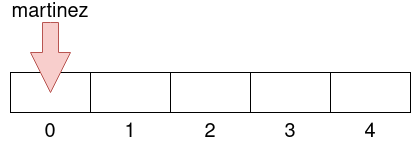

Para llevar a cabo esta operación, necesitamos realizar varias comprobaciones:

- Si la lista de elementos está llena

  ```java
  if (contadorElementos == longitudArray) {
              printText("Error: La lista de apellidos está llena. \n");
  }
  ```

- Si en la posición introducida ya existe un elemento almacenado

  ```java
  if (lista[posicion] != null) {
              printText("Error: La posición introducida está siendo utilizada. \n");
  }
  ```

- Que no se permita introducir una posición si en la anterior no hay ningún elemento

  ```java
  else if (posicion > 0 && lista[posicion - 1] == null) {
              printText("Error: La posición anterior no contiene valores. \n");
  }
  ```

  

### 2.3 Localizar

Esta operación permite localizar la primera posición en la que se encuentra un determinado elemento introducido por el usuario.

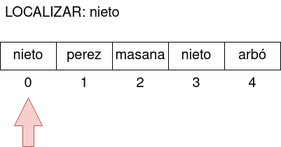

Para llevar a cabo esta operación, necesitamos realizar las siguientes comprobaciones:

- Si la lista de apellidos no contiene ningún elemento (está vacía)

  ```java
  if (listaVacia(contadorElementos)) {
              printText("Error: No se puede buscar ningún elemento. La lista está vacía. \n");
  }
  ```

- Si el elemento que hemos introducido se encuentra almacenado dentro de la lista

  ```java
  if (!status) {
              printText("Error: No se han encontrado coincidencias. \n");
  }
  ```

  

### 2.4 Recuperar

Esta operación permite encontrar el elemento que se encuentra en una determinada posición introducida por el usuario.

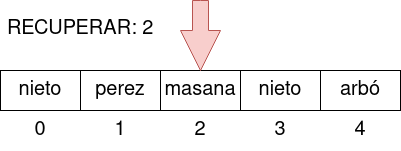

Las comprobaciones, en este caso, son las mismas que se realizan en la operación Localizar.


### 2.5 Suprimir

Esta operación permite eliminar de la lista el elemento que se encuentra en una determinada posición introducida por el usuario.

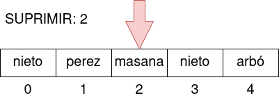

Cuando se trabaja con arrays no se pueden eliminar valores, para simularlo lo que hacemos es mover hacia la izquierda todos los valores posteriores a la posición que queremos eliminar.

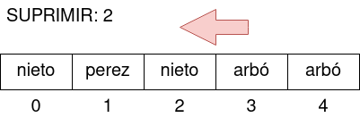

Como el último valor aparecerá duplicado le asignamos un NULL y de esta manera quedará vacío.

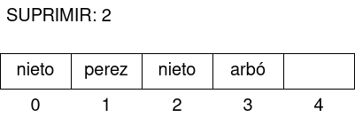

Para llevar a cabo esta operación, necesitamos realizar las siguientes comprobaciones:

- Si la lista de elementos no contiene ningún elemento (está vacía)

  ```java
  if (listaVacia(contadorElementos)) {
              printText("Error: No se puede suprimir ningún valor. La lista está vacía. \n");
  }
  ```

- Si la posición introducida existe dentro de la lista

  ```java
  if (!existePosicion(posicion, contadorElementos)) {
              printText("Error: La posición indicada no existe dentro de la lista. \n");
  }
  ```

  

### 2.6 SuprimirDato

### 2.7 Anular

Esta operación permite vaciar la lista y eliminar así todos los elementos que contiene.

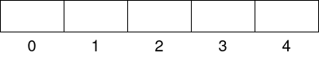

Para llevar a cabo esta operación, necesitamos realizar una única comprobación:

- Si la lista ya se encuentra vacía

  ```java
  if (listaVacia(contadorElementos)) {
              printText("Error: La lista ya se encuentra vacía. \n");
  }
  ```

  

### 2.8 PrimeroUltimo

Esta operación muestra un menú secundario dentro del switch con dos opciones posibles. La única comprobación que realizamos es que la lista no se encuentre vacía. Si hay un único elemento dentro de la lista, este será tanto el primero como el último.

- ### 2.8.1 Primero

  Muestra el primer elemento de la lista.

  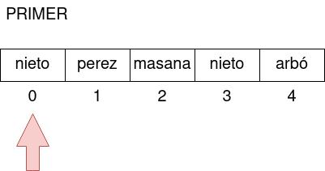

- ### 2.8.2 Ultimo

  Muestra el último elemento de la lista.

  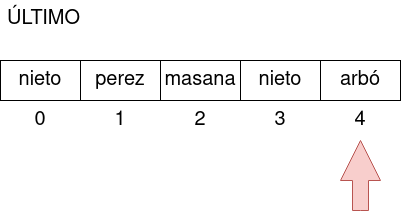

### 2.9 Imprimir

Esta operación imprime todos los elementos de la lista desde el primero al último y mostrando su posición

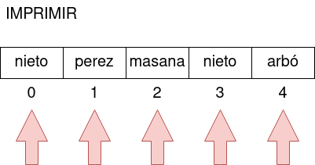


La única comprobación que se hace en este caso es si está vacía o no.

```java
if (listaVacia(contadorElementos)) {
            printText("Error: No se puede imprimir ningún valor. La lista de apellidos está vacía. \n");
}
```


### 2.10 Ordenar

Esta operación ordena lexicográficamente los elementos de la lista.

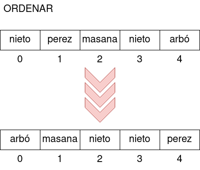

Como en operaciones anteriores, la única comprobación que realizamos es si la lista está vacía

```java
if (listaVacia(contadorElementos)) {
            printText("Error: No se puede ordenar una lista sin elementos. \n");
}
```

Para esta operación, hemos utilizado el método **compareTo** de la clase **String** de Java. Este método permite comparar 2 cadenas de caracteres y devuelve un entero. Dependiendo de su valor tendrá un significado u otro:

- Si el resultado es mayor que 0: **el primer string es mayor** que el segundo
- Si el resultado es 0: ambas cadenas son **iguales**
- Si el resultado es menor que 0: **el primer string es menor** que el segundo

```java
for (int i = 0; i < contadorElementos; i++) {
    for (int k = i + 1; k < contadorElementos; k++) {
        if (lista[i].compareTo(lista[k]) > 0) {
                  /*
                  Asignamos el string más grande a la variable mayor
                  */
                  mayor = lista[i];

                  /*
                  El valor menor intercambia la posición con el mayor
                  */
                  lista[i] = lista[k];

                  /*
                  Asignamos a la siguiente posición el mayor, para ir ordenando (de menor a mayor)
                  */
                  lista[k] = mayor;
        }
    }
}
```

El primer bucle recoge el primer elemento, el segundo recoge el elemento posterior. El condicional los compara y si el resultado es mayor que cero se intercambian las posiciones y se realiza la siguiente iteración en el segundo bucle. De esta manera se va comparando siempre el elemento de la primera posición con el resto de elementos. 

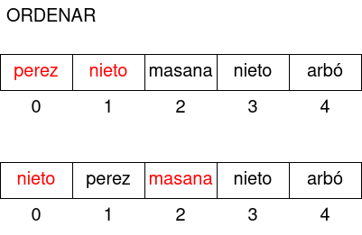

Cuando se realizan todas las iteraciones del segundo bucle. El primer bucle se incrementa en uno y se realiza nuevamente toda la comprobación a partir de la posición con índice 1. De esta manera se ordena todo el array lexicográficamente.


**NOTA:** Al utilizar funciones en nuestra aplicación, hemos reaprovechado el código de ***localizar()*** y ***suprimirDato()*** y no tenemos que volver a programar ***LocalizarEnOrdenada()*** y ***SuprimirDatoEnOrdenada()*** ya que su funcionamiento es el mismo.


## 3. Funciones de Entrada/Salida de datos (I/O)

Para evitar repetir código en la aplicación he creado diferentes funciones que nos permiten gestionar las entradas y salidas de datos. Son las siguientes:

### 3.1 PrintMenu

Permite imprimir cada elemento de un Menú y los enumera (desde 1 en adelante).

```java
public static void printMenu(String[] menu) {
        for (int i = 0; i < menu.length; i++) {
            if (menu[i] != null) {
                System.out.println((i + 1) + ". " + menu[i]);
            }
        }
}
```


### 3.2 PrintText

Permite mostrar por pantalla un determinado mensaje. Sirve para abreviar el ***System.out.println().***

```java
public static void printText(String mensaje) {
        System.out.println(mensaje);
}
```


### 3.3 EnterInt

Permite introducir un número entero por terminal y añadir un mensaje. Es como tener un ***Scanner*** y un ***System.out.println()*** a la vez. Se realiza una comprobación para evitar que se introduzca un valor vacío.

```java
public static int enterInt(String mensaje) {
        Scanner consola = new Scanner(System.in);
        String digito;
        int numero;

        printText(mensaje);

        do {
            digito = consola.next();
        } while (digito.isEmpty());

        numero = Integer.parseInt(digito);

        return numero;
}
```


### 3.4 EnterString

Lo mismo que el anterior, pero para cadenas de caracteres.

```java
public static String enterString(String mensaje) {
        Scanner consola = new Scanner(System.in);
        String texto;

        printText(mensaje);

        do {
            texto = consola.nextLine();
        } while (texto.isEmpty());

        return texto;
}
```


## 4. Funciones para realizar comprobaciones

También para evitar repetir código ya que en muchas de las operaciones se realizaban las mismas comprobaciones, he creado estas tres funciones:

### 4.1 ListaVacia

Permite conocer si la lista contiene algún elemento o está vacía.

```java
public static boolean listaVacia(int contadorElementos) {
        boolean vacio;

        vacio = (contadorElementos == 0);

        return vacio;
}
```


### 4.2 ExisteElemento

Permite conocer si un determinado elemento existe dentro de la lista.

```java
public static boolean existeElemento(String[] lista, String busqueda, int contadorElementos) {
        boolean existe = false;

        for (int i = 0; i < contadorElementos; i++) {
            if (busqueda.equals(lista[i])) {
                existe = true;
                break;
            }
        }

        return existe;
}
```


### 4.3 ExistePosicion

Permite conocer si una determinada posición existe dentro de la lista.

```java
public static boolean existePosicion(int posicion, int contadorElementos) {
        boolean existe = false;
        for (int i = 0; i < contadorElementos; i++) {
            if (posicion == i) {
                existe = true;
                break;
            }
        }

        return existe;
}
```


## 5. Menu's

Para finalizar, he creado también 3 funciones que permiten mostrar los menús y recoger la opción introducida por el usuario.

### 5.1 MenuPrincipal

Menú Principal de la aplicación.

```java
public static int menuPrincipal() {
        int opcion;

        String[] menu = {
                "Insertar un apellido en la lista",
                "Localizar la posición de un apellido",
                "Localizar un apellido",
                "Eliminar un apellido",
                "Eliminar todos los apellidos iguales",
                "Vaciar la lista de apellidos",
                "Mostrar primer/último apellido",
                "Listar apellidos con su posición",
                "Ordenar la lista de apellidos",
                "Salir"
        };

        printMenu(menu);
        opcion = enterInt("Escoge una opción;");

        return opcion;
}
```


### 5.2 MenuFirstLast

Menú secundario para la selección de Primero o Último.

```java
public static int menuFirstLast() {
        int opcion;

        String[] menuPrimeroUltimo = {
                "Muestra primer apellido de la lista",
                "Muestra último apellido de la lista",
                "Atrás"
        };

        printMenu(menuPrimeroUltimo);
        opcion = enterInt("Escoge una opción: ");

        return opcion;
}
```


### 5.3 MenuOrdenar

Menú secundario para realizar las gestiones de lista ordenada

```java
public static int menuOrdenar() {
        int opcion;

        String[] menuOrdenar = {
                "Busqueda en lista ordenada de apellidos",
                "Eliminar apellidos desde lista ordenada",
                "Muestra la lista ordenada de apellidos",
                "Atrás"
        };

        printMenu(menuOrdenar);
        opcion = enterInt("Escoge una opción: ");

        return opcion;
}
```

**NOTA**: En este menú, añadí una tercera opción para listar los elementos y hacer comprobaciones.
